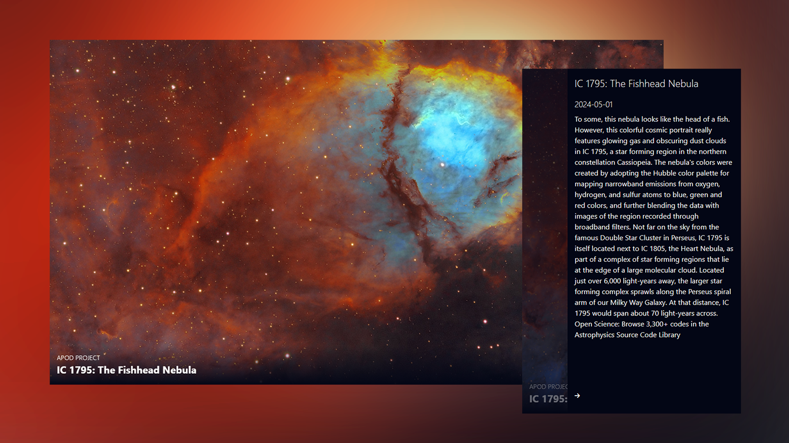

# Nasa App

### Space Gallery website that displays NASA's picture of the day - <a href="https://dorkatzir.github.io/nasa-api-reactjs/" target="_blank">live Demo</a>

###  React.JS app with Nasa API and Local Storage 

### Resources:
<ul>
    <li>
        <a href="https://code.visualstudio.com/" target="_blank">VSCode</a>
        <a href="https://nodejs.org/en/download" target="_blank">NodeJS</a>
        <a href="https://vitejs.dev/guide/" target="_blank">Vite</a>
        <a href="https://cdnjs.com/libraries/font-awesome" target="_blank">FontAwesome CDN</a>
        <a href="https://www.fontawesome.com" target="_blank">FontAwesome Icons</a>
        
    </li>
</ul>
 

### Screenshot:

